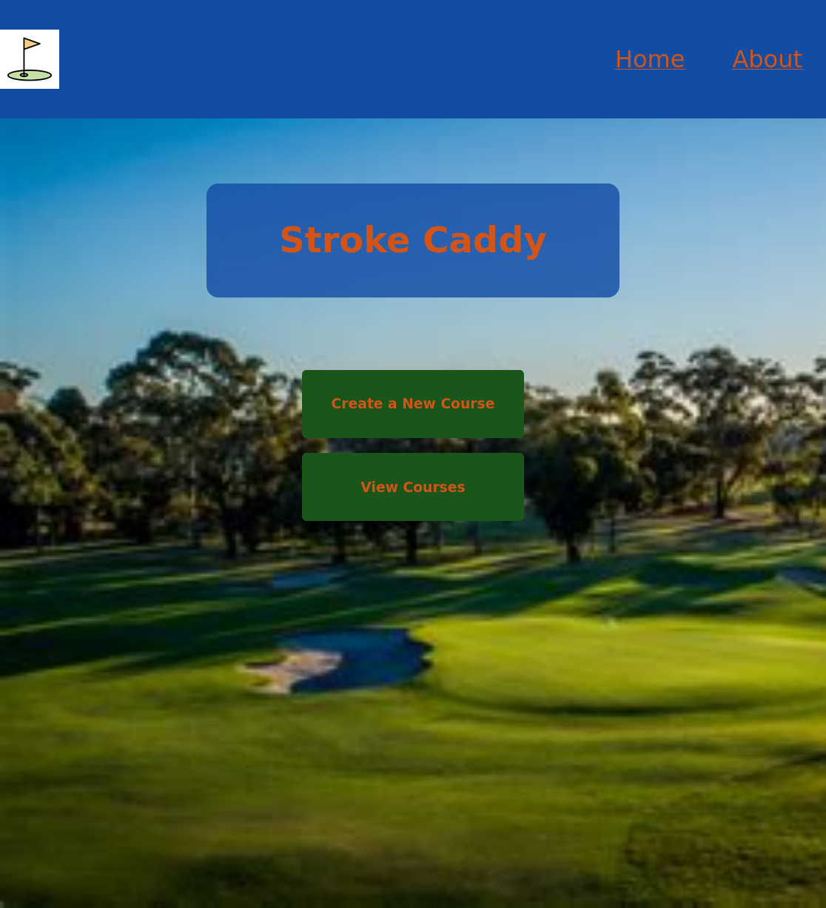

# StrokeCaddy -Golf stroke tracker-

## Date: 7/23/2022

### By: Steve Kim

#### [StrokeCaddy](https://strokecaddy.herokuapp.com/) | [GitHub](https://github.com/Skim1571) | [LinkedIn](https://www.linkedin.com/in/steve-kim-b641541b/) | [Trello](https://trello.com/b/c63ML0GP/stroke-caddy)

---

### **_Description_**

#### Creating a golf stroke tracking app. This app will keep track of the player's stroke and club used for that stroke. The user will be able to POST their stroke & used club. The User can also GET a prior game's score / club usage. The user will also be able to Update their score and Delete a recorded game.

### Phase I Complete: The App currently allows users to Create a new course. The user is then able to view all created courses and make changes or delete a course. As this app continues to develop more functionality will allow player strokes to be recorded / updated / deleted.

---

### **_Technologies Used_**

- MongoDB
- Express
- React
- Node.js

---

### **_Getting Started_**

#### You will start in the home page, choose either to review a prior historical game or to start a new game. If you choose to review the prior game, you will be able to select the prior game to either edit or delete the game. If you choose to start a new game, you can input your strokes&used club per hole.

---
### **_Project Management_**

#### [ERD](): My Initial ERD.

#### [Trello](https://trello.com/b/c63ML0GP/stroke-caddy): I will use a Trello board to outline key milestones in creating the app development.
---

### **_Screenshots_**

#### Image 1

#### Image 2

---

### **_Future Updates_**

- [ ] Create Course Import
- [ ] Create User Score Input
- [ ] Create Multi-User Score Input

---

### **_Credits_**

#### Image 1: https://static.vecteezy.com/system/resources/previews/000/425/552/original/golf-icon-vector-illustration.jpg

#### Image2: https://external-content.duckduckgo.com/iu/?u=https%3A%2F%2Ftse4.mm.bing.net%2Fth%3Fid%3DOIP.uPnf0rumaqlac5Ar4F9fIQHaEK%26pid%3DApi&f=1)

#### Springbrook ScoreCard: https://golfnaperville.org/wp-content/uploads/2018/10/Springbrook-Inside-scorecard.jpg
---

Footer
© 2022 GitHub, Inc.
